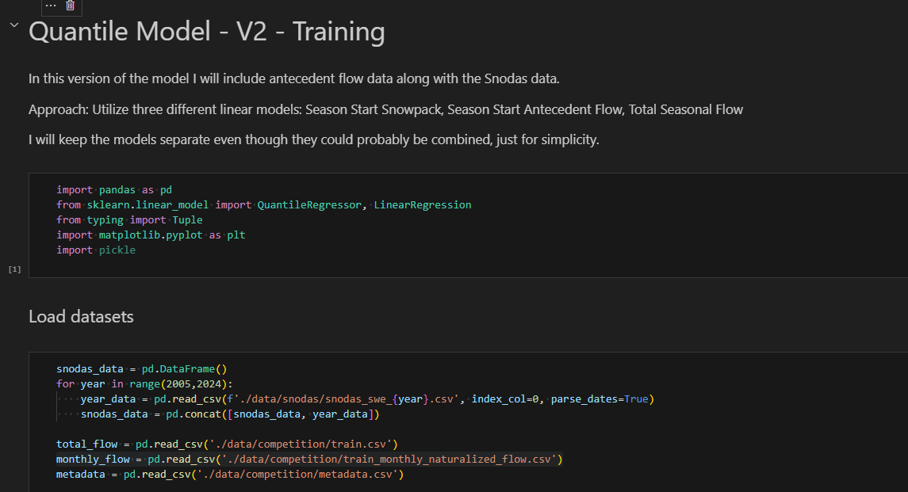
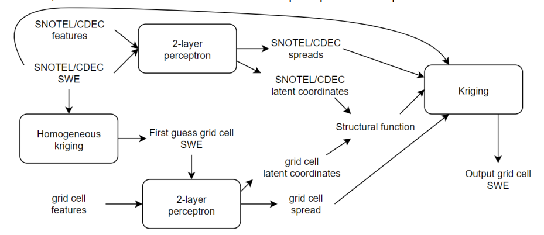
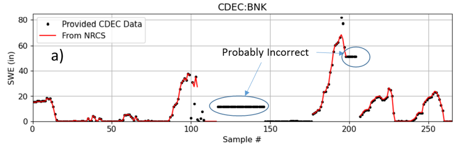
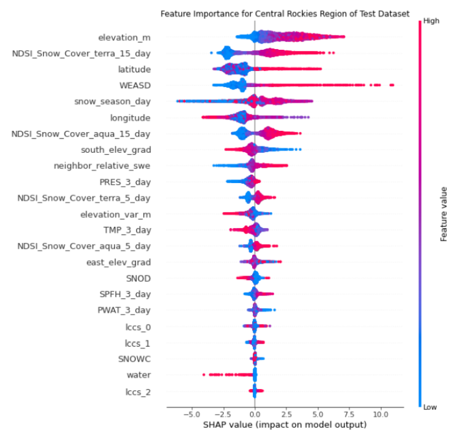

### Overview

Last winter I tried my hand at competing in a machine learning competition to predict snow water equivalent (SWE) across the Western United States. I learned a lot and created a two part blog series to document both the competition and my approach:

- [Machine Learning for Snow Hydrology - A Competition](https://crceanalytics.com/2022/04/07/machine-learning-for-snow-hydrology-a-competition/)
- [Machine Learning for Snow Hydrology - Methods](https://crceanalytics.com/2022/05/11/machine-learning-for-snow-hydrology-methods/)

I competed in the preliminary phase of the competition that didn’t include any prizes. The second phase involved predicting SWE in real time and included big prizes totaling $500,000. The competition ended in early summer, but the winners were just recently announced on the DrivenData Blog:

- [Meet the winners of the Snowcast Showdown competition - DrivenData Labs](https://drivendata.co/blog/swe-winners)

There wasn’t just one winner, but winners in several categories including regional categories and awards for the top three reports describing the competitor's model. The top prize went to a team of mathematicians who were able to predict SWE across the US with a RMSE of 3.88. Contrast that with the RMSE from my model of 9.32, and that isn’t even using real time data.

<figure>

<figcaption>

Competition finalists - from DrivenData Blog

</figcaption>

</figure>

The top five contestants all won significant (by my standards) sums of money, and here I want to give a brief summary of each approach used in the competition. With the exception of the top prize winner, each team also submitted a report describing their approach ([GitHub - drivendataorg/snowcast-showdown](https://github.com/drivendataorg/snowcast-showdown)). Surprisingly, I was disappointed with the quality of these reports, especially given that a winning report received 10's of thousands of dollars in prize money. It is unclear if the prize for reports was only awarded to contestants who were also in the top spots of the winning categories or if anyone submitting a report could have potentially won. Regardless, I don't think the report competition was adequately incentivized because it appears contestants felt their chance of winning did not justify the time it would take to write a detailed summary of their model. I shouldn’t be too critical, as there was likely a language barrier with the international contestants, but I wonder if the Bureau of Reclamation, who sponsored the competition presumably to improve their SWE prediction abilities, will find it challenging to translate the reports into an actionable workflow.

Nonetheless, the reports and post competition interviews give lots of information about what methods were used by the contestants. The biggest challenge in assessing each winner is my current skill level with machine learning. So, I will do my best to go explain each winner’s methods, and then give some reflections on what impact this competition has had on my thinking.

### Winners

#### _First Place ($170,000)_

The winners of the top prize, with an overall RMSE of 3.88, are a pair of mathematicians, one from Russian and the other from the UK. Both have experience with problems involving the physical sciences. This is the only winning team that did not submit a report on their model, so my understanding of their approach is limited to the competition blog and a "[Readme](https://github.com/drivendataorg/snowcast-showdown/blob/main/1st%20Place/README.md)" file in the competition repository. All winning models are available for download, but I don’t know how easy it would be to get one working.

Their approach uses a combination of a neural network and interpolation via kriging. The neural network component is described as a two layer perceptron, and it appears to be used to predict the parameters used in the kriging. The model inputs are not well described, but input data sources include Snotel, DEM, land cover/soils, and MODIS satellite.

<figure>

<figcaption>

First place model diagram - from post competition interview

</figcaption>

</figure>

Kriging is a method for interpolating spatial data that uses the statistics of the known data points to estimate the values between points. A [perceptron](https://en.wikipedia.org/wiki/Perceptron) is an early version of a neural network originally used for classification. When multiple layers are utilized, it can be used for regression. Beyond that, the information given by the competitors was high level math jargon that I wasn’t able to parse.

#### _Second Place ($135,000)_

The second place winners are a team of five, mostly associated with Lomonosov Moscow State University. Many are research hydrologists with experience in machine learning. This team did submit a report, which is well written, especially for non-native English speakers (I am guessing), and it won second place in the report competition.

Their approach uses “state of the art implementations of Gradient Boosting Machine (GBM) algorithm”. [Gradient boosting](https://en.wikipedia.org/wiki/Gradient_boosting) uses an iterative approach, like a gradient descent, to train a machine learning model, and appears to be common when using decision tree models. The team actually uses three different gradient boost algorithms:

- XGBoost - [xgboost.ai](https://xgboost.ai)
- LightGBM - [lightgbm.readthedocs.io/](https://lightgbm.readthedocs.io/)
- CatBoost - [catboost.ai](https://catboost.ai)

The output from these models is then input into a final gradient boost model to generate the predicted SWE values. I think the idea behind the final model is to try and compensate for any bias that might be present in the output of the first three models.

The team utilizes their earth science knowledge and experience to select which input features might be most useful in their model and they ended up utilizing 120 features! These features are extracted from a variety of data sources:

- [Snotel/CDEC](https://www.nrcs.usda.gov/wps/portal/wcc/home/snowClimateMonitoring/snowpack/snowpackMaps/)
- [MODIS](https://modis.gsfc.nasa.gov/)
- [NOAA High Resolution Rapid Refresh Model](https://rapidrefresh.noaa.gov/hrrr/)
- [Copernicus DEM](https://spacedata.copernicus.eu/web/cscda/dataset-details?articleId=394198)

Snotel/CDEC data is interpolated prior to using it in the model using “random forest” which they is better than kriging. A fully featured snow evolution model ([openAMUNDSEN](https://doc.openamundsen.org/)) is tested, but was too slow for real time predictions. Despite the high degree of expertise, I still get the impression much of the work is plugging as many relevant features into the model as possible and seeing what works.

#### _Third Place ($60,000)_

The third place winners are a team of 4 professors from the University of Arizona. Their approach is unique among the winners in that only the Snotel/CDEC data is used to make predictions. This eliminates the need for complex processing of satellite and weather models, as well as, makes the computation of new SWE predictions fast and easy. Their model can easily be run on a desktop computer. The fact that they were able to achieve third place makes me think [my simple approach](https://crceanalytics.com/2022/05/11/machine-learning-for-snow-hydrology-methods/) might have done a lot better with some minor improvements.

The model used by the UA team is a mult-linear regression relating the SWE at a particular location to several of the nearby Snotel/CDEC sites. It is a bit unclear from the report how many nearby sites are used, but it appears the number is found by model tuning. The Snotel/CDEC sites are weighted based on the R2 value between a particular station and location.

Another unique approach used by this team is to use a completely new data set, not provided by the competition (but still allowed) for training. This is a 4km grid of SWE values developed by UA and available from the [NSIDC](https://nsidc.org/data/nsidc-0719/versions/1). This dataset has daily SWE values across the Western US from 1981 to 2021. In order to relate the Snotel/CDEC data to the UA SWE dataset, the team had to ensure there were no data gaps, or anomalies, in the Snotel/CDEC data. It appears a good percentage of this team's effort was simply devoted to gap filling and data quality control.

<figure>

<figcaption>

Example of QC work performed by 3rd place winners - from model report

</figcaption>

</figure>

#### _Fourth Place ($65,000)_

The fourth place winner is a freelance data scientist from Ukraine with prior experience participating in machine learning competitions. He submitted a report summarizing his approach, unfortunately I find it largely in-comprehensible. To his credit it is undoubtedly challenging to summarize your work in English if it isn’t your first language. However, most of the difficulties I had stem from extensive use of machine learning jargon. For example, he describes his model as “a neural network model with different layer architectures: Fourier neural operator, convolution layers, embeddings, and linear transformation.” My high level interpretation is that there is a somewhat complex neural network model being trained using features from the same data sources used by the second place team.

#### _Fifth Place ($70,000)_

The final prize winner, coming in 5th overall, but also winning first in the report competition is a machine learning engineer from Denver, CO. I agree with the judges that this is the best report, as there is both a clear explanation of the approach used and the model performance. In brief, the methods used are similar to the second place winners utilizing “gradient boosting decision tree” algorithms.

Unlike, the second and third place winners, this competitor doesn’t appear to have snow hydrology expertise that can give insight into the physics of snow accumulation and melt. However, he does appear to have a great understanding for how to best improve a machine learning model and can rely on common sense to test different ideas. For example, an initial baseline model was developed using just historical averages of SWE for different regions, and it outperformed my model with a reported RMSE of 8.15. This baseline model provided a starting point from which to build better models.

A somewhat large number of features are "engineered" from the datasets used by the other contestants, as well as, some parameters indicating how snow in a particular grid cell compares to it's neighbors. Model performance evaluation indicated that some of the features with high value are MODIS measurements, elevation, and snow depth output by the HRRR.

It is also interesting to note that real time SWE prediction can be especially tricky due to lagging or missing input data (like satellite observations obscured by clouds). As mentioned earlier, the third place winners spent a good deal of time fixing missing or anomalous data. Some types of models, in particular the GBM approach used by this competitor, are better able to handle missing data by default.

<figure>

<figcaption>

Performance metric for different input features used by 5th place winner - from model report

</figcaption>

</figure>

## Reflections and Takeaways

I find the demographics of the winning competitors interesting. Despite, the competition data being specific to the Western US, only two of the teams were from the US. It seems like US based competitors might have had an advantage, especially snow hydrology researchers who would have been familiar with the Snotel network and current research literature. That makes me think the expertise required for this kind of competition is lacking in the US relative to other parts of the world. Furthermore, many of the winners are from Moscow, Russia and another from Ukraine. I get the impression, based on this competition and other experiences, that there are a lot of talented data scientists in this part of the world. I wonder if distribution of prize money is complicated by the current geopolitical situation. After all, the competition is sponsored by the US government and Russia is under sanctions.

Some of the winners were definitely able to leverage their expertise in snow hydrology. However, top prizes went to competitors that appear to have minimal experience with snow, but high levels of learning in math and numerical problem solving. My conclusion is that machine learning remains somewhat of a black box. A winning approach is to simply cram as many different seemingly relevant inputs into the model as possible until it produces the correct answer. There remains a lack of understanding as to the details of how the inputs are controlling snow processes.

Finally, when it comes to developing a machine learning model, it is clear from this competition that there is a lot of trial and error, model iteration, and model tuning required in order to get the best possible performance. At the start, I was under the impression that the key to winning would be understanding snow processes and being able to turn them into a single well designed model. However, many of the winners in this competition tried and then rejected a number of approaches before iteratively improving their final model.

Congratulations to all the winners!
